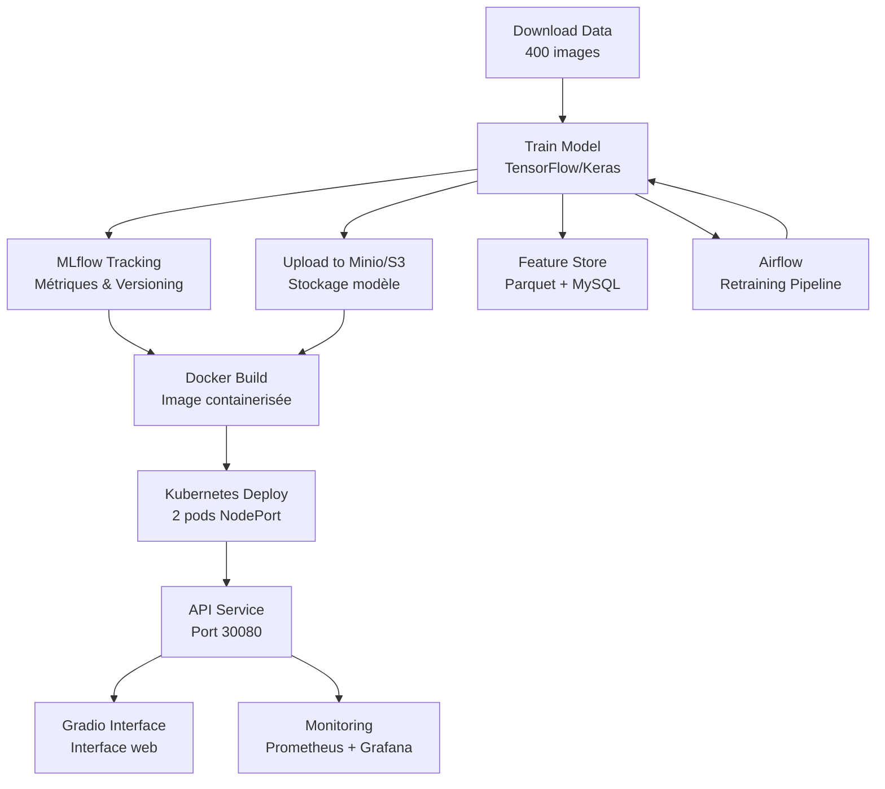

# Pipeline MLOps - Diagramme

```mermaid
graph TD
    A[Download Data<br/>400 images] --> B[Train Model<br/>TensorFlow/Keras]
    B --> C[MLflow Tracking<br/>Métriques & Versioning]
    B --> D[Upload to Minio/S3<br/>Stockage modèle]
    B --> E[Feature Store<br/>Parquet + MySQL]
    C --> F[Docker Build<br/>Image containerisée]
    D --> F
    F --> G[Kubernetes Deploy<br/>2 pods NodePort]
    G --> H[API Service<br/>Port 30080]
    H --> I[Gradio Interface<br/>Interface web]
    H --> J[Monitoring<br/>Prometheus + Grafana]
    B --> K[Airflow<br/>Retraining Pipeline]
    K --> B
```
